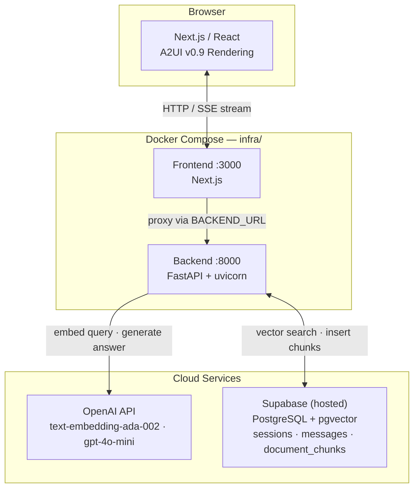
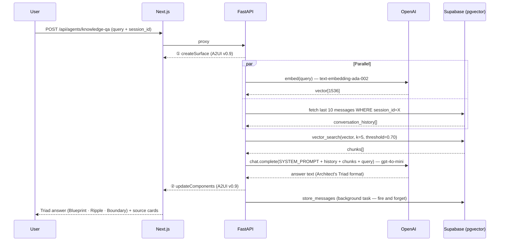
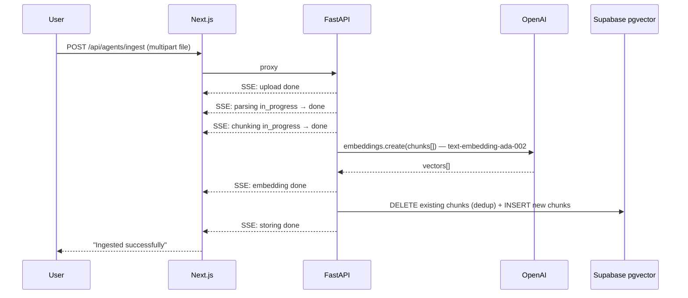

# A2UIPlatform Architecture Overview

**Last Updated:** April 2026  
**Status:** MVP Complete

---

## 1. System Layers

```
┌─────────────────────────────────────────────────────────────────┐
│                          CLIENT (Browser)                       │
│  ┌─────────────────────────────────────────────────────────┐   │
│  │  FRONTEND (Next.js)                                     │   │
│  │  ┌──────────────────────────────────────────────────┐   │   │
│  │  │ PlatformShell (Nav + Surface Area)              │   │   │
│  │  ├──────────────────────────────────────────────────┤   │   │
│  │  │ Active App: KnowledgeQAApp                       │   │   │
│  │  │ ├─ DocumentDrawer (left sidebar, w-12↔w-80)    │   │   │
│  │  │ ├─ QueryInput (textarea) + ThinkingIndicator    │   │   │
│  │  │ └─ TurnView[] (one per query, latest on top)    │   │   │
│  │  │     └─ SurfaceView (surfaceId scoped)           │   │   │
│  │  │         └─ ComponentHost → Catalog components  │   │   │
│  │  └──────────────────────────────────────────────────┘   │   │
│  └─────────────────────────────────────────────────────────┘   │
└─────────────────────────────────────────────────────────────────┘
         │
         │ SSE (Server-Sent Events)
         │ POST /api/agents/knowledge-qa?query=...
         │ Content-Type: text/plain; charset=utf-8
         │ A2UI JSONL (createSurface, updateComponents)
         │
         ▼
┌─────────────────────────────────────────────────────────────────┐
│                    BACKEND (Python FastAPI)                     │
│  ┌─────────────────────────────────────────────────────────┐   │
│  │ POST /api/agents/knowledge-qa (query + session_id + surface_id) │
│  │  1. Validate query; read session_id + surface_id from params │
│  │  2. Stream Message 1: createSurface(surface_id)         │   │
│  │  3. PARALLEL: embed query + fetch last 10 history msgs  │   │
│  │  4. pgvector similarity search (match_document_chunks)  │   │
│  │  5. Filter chunks below MIN_SIMILARITY threshold        │   │
│  │  6. Build prompt: SYSTEM_PROMPT + history + chunks      │   │
│  │  7. OpenAI gpt-4o-mini: generate answer (Triad format)  │   │
│  │  8. Stream Message 2: updateComponents(surface_id)      │   │
│  │  9. Background task: store_messages(session_id, ...)    │   │
│  └─────────────────────────────────────────────────────────┘   │
└─────────────────────────────────────────────────────────────────┘
         │
         │ pgvector queries + session reads/writes
         │
         ▼
┌─────────────────────────────────────────────────────────────────┐
│                    DATA LAYER (Supabase — hosted)               │
│  ┌─────────────────────────────────────────────────────────┐   │
│  │ document_chunks (id, content, embedding, metadata)      │   │
│  │ sessions        (id, name, created_at, updated_at)      │   │
│  │ messages        (id, session_id, role, a2ui_payload)    │   │
│  └─────────────────────────────────────────────────────────┘   │
└─────────────────────────────────────────────────────────────────┘
```

### System Architecture



### Query Flow



### Ingestion Flow



---

## 2. Frontend Architecture

For code rules and layer boundary rules, see [Governance.md](Governance.md).

### Core Stack Decisions

| Choice | Tech | Reason |
|--------|------|--------|
| **Framework** | React 19 + Next.js 16+ | App Router for clean routing, SSR-ready, fast refresh |
| **Styling** | Tailwind CSS 4 + design tokens | Utility-first, single source of truth via `designTokens.ts` |
| **Components** | shadcn/ui (headless) | Composable, unstyled base for design token customization |
| **State** | Zustand (platform level) | Lightweight, minimal boilerplate for app registry + global UI |
| **Protocol** | A2UI v0.9 via MessageProcessor | Decoupled rendering layer, vendor-agnostic |
| **Transport** | SSE over fetch + ReadableStream | Unidirectional streaming; no library, fits LLM token-by-token output |

### Component Hierarchy

```
App Root (Next.js)
 │
 └─ PlatformShell (Layout)
     ├─ NavBar
     │  └─ AppSwitcher (route-aware dropdown)
     │
     └─ Surface Area
        └─ Active App (KnowledgeQAApp, etc.)
           ├─ DocumentDrawer (left sidebar/overlay)
           ├─ QueryInput + ThinkingIndicator
           │
           └─ TurnView[] (one per query, latest on top)
               └─ SurfaceView (scoped to surfaceId)
                   └─ ComponentHost
                       └─ Catalog Components (mapped from A2UI types)
                           ├─ TextComponent      (h1/h2/h3/body/caption)
                           ├─ CardComponent
                           ├─ ButtonComponent
                           ├─ BadgeComponent
                           ├─ MarkdownComponent  (react-markdown + GFM; [N] → citation badges)
                           ├─ SourceListComponent (compact strip; registers sources via sourceRegistry)
                           └─ MetadataCard
```

### State Ownership

| Layer | State Owner | Scope |
|-------|-------------|-------|
| **Platform** | `platformStore` (Zustand) | Current active app, global UI state |
| **A2UI Surface** | `MessageProcessor` (@a2ui/web_core/v0_9) | Component definitions, data bindings, rendering tree |
| **App** | Component local state (React hooks) | Query input, form state, validation |
| **Transport** | None (SSE only) | No polling, no persistent connection state |

**Rule:** MessageProcessor is the single source of truth for surface state. Never duplicate it.

### Data Flow (Message Sequence)

```
1. User types query
   ↓
2. KnowledgeQAApp.onSubmit()
   ├─ Validate query
   ├─ useAgentStream.start(query, session_id, surface_id=qa-turn-<uuid>)
   └─ Set status → STREAMING
   ↓
3. useAgentStream opens stream (fetch POST + ReadableStream)
   └─ POST /api/agents/knowledge-qa?query=...&surface_id=qa-turn-<uuid>&session_id=<uuid>
   ↓
4. MessageProcessor receives messages (in order):
   ├─ Message 1: createSurface  → registers surfaceId="qa-turn-<uuid>", catalogId="stub"
   └─ Message 2: updateComponents → defines [answer-label, answer-body, meta-info, sources-list]
   ↓
5. TurnView (per query) subscribes to its surfaceId via onSurfaceCreated
   ├─ SurfaceView renders when surface arrives
   ├─ Catalog components render with design tokens
   └─ User sees: latest turn at top; all prior turns below
   ↓
6. Stream closes; store_messages() fires as background task → Status → DONE
```

### A2UI Rendering Layer

```
A2UI Protocol Message (JSONL)
  ↓
useAgentStream (SSE transporter)
  ↓
MessageProcessor (@a2ui/web_core/v0_9)
  ├─ Parse createSurface → creates surface model
  └─ Parse updateComponents → sets component definitions + props
  ↓
A2UISurface (React component)
  └─ Subscribes to MessageProcessor events → renders SurfaceView per surface
      ↓
      ComponentHost (dynamic resolver)
      └─ Resolves A2UI component type → React component → styled via designTokens.ts
```

### SSE Communication Layer

**Why SSE over WebSocket/polling:** Unidirectional (server → browser), no library needed (fetch + ReadableStream), stateless per-connection, fits LLM inference streaming perfectly.

```
useSSE hook:
├─ Opens fetch() POST with AbortController
├─ Reads response.body as ReadableStream
└─ Parses newline-delimited JSON → feeds to MessageProcessor

Resource management:
├─ Explicit .abort() on route change (prevent leaks)
├─ Single connection per query (no pooling)
└─ Auto-close after stream ends
```

### Design System Integration

All styling driven by design tokens — defined in `src/a2ui/catalog/designTokens.ts`.

```
A2UI Prop (usageHint: "h2")
  ↓
TextComponent.getTokenForHint("h2")
  ↓
designTokens.typography.h2 → { fontSize: "1.5rem", fontWeight: "700", color: "#1F2937" }
  ↓
Tailwind className: "text-2xl font-bold text-gray-900"
```

---

## 3. Backend Architecture

### Core Stack Decisions

| Choice | Tech | Reason |
|--------|------|--------|
| **Framework** | FastAPI + uvicorn | Native async, `StreamingResponse` for SSE, auto-docs, minimal overhead |
| **Embedding** | OpenAI `text-embedding-ada-002` (1536-dim) | Cost-effective, high-quality for retrieval; same model as stored vectors |
| **Vector Store** | Supabase pgvector | No separate infra; co-located with session data; `match_document_chunks` RPC |
| **LLM** | OpenAI `gpt-4o-mini` | Strong reasoning at low cost; sufficient for structured Triad responses |
| **Session Store** | Supabase PostgreSQL JSONB | Reuses existing DB; `a2ui_payload` stored as-is for protocol-exact hydration |
| **Async** | `asyncio.gather` | Embed query + fetch history in parallel; reduces query latency by ~120ms |
| **Background tasks** | FastAPI `BackgroundTasks` | Fire-and-forget message persistence after stream closes; does not block response |
| **Orchestration** | Direct SDK calls | No LangChain overhead; full control over prompt construction and streaming |

### RAG Pipeline

The full pipeline runs inside `knowledge_qa_agent.py`:

```
1. Receive (query, session_id, surface_id)
   ↓
2. Stream createSurface(surface_id) — client can render skeleton immediately
   ↓
3. asyncio.gather:
   ├─ embed_query(query) → OpenAI text-embedding-ada-002 → vector[1536]
   └─ _fetch_history(session_id) → SELECT last 10 messages ORDER BY created_at ASC
   ↓
4. match_document_chunks(embedding=vector, match_count=5)
   → Supabase pgvector RPC (cosine similarity via <#> operator)
   ↓
5. Filter: discard chunks where similarity < MIN_SIMILARITY (0.70)
   → Prevents low-quality context from polluting the LLM prompt
   ↓
6. Build prompt:
   SYSTEM_PROMPT (Architect's Triad instructions)
   + "Previous conversation:\n{history_block}"
   + "Context:\n{chunk_content × N}"
   + "Question: {query}"
   ↓
7. openai.chat.completions.create(model="gpt-4o-mini", stream=True)
   ↓
8. Buffer full response → build A2UI components:
   TextComponent(h2) "The Blueprint"    + MarkdownComponent(blueprint_text)
   TextComponent(h2) "The Systemic Ripple" + MarkdownComponent(ripple_text)
   TextComponent(h2) "The Boundary Condition" + MarkdownComponent(boundary_text)
   SourceListComponent(sources[])
   ↓
9. Stream updateComponents(surface_id, components[])
   ↓
10. BackgroundTasks.add_task(store_messages, session_id, query, a2ui_payload)
    → Fire-and-forget INSERT into messages table; does not block the SSE response
```

### Ingest Pipeline

The full pipeline runs inside `ingest_agent.py`, streaming SSE progress at each step:

```
1. Receive multipart file upload
   → SSE: { step: "upload", status: "done" }
   ↓
2. Parse raw text from file:
   PDF  → pypdf (page-by-page extraction)
   DOCX → python-docx (paragraph extraction)
   TXT/MD → direct read
   → SSE: { step: "parsing", status: "done" }
   ↓
3. Chunk text:
   RecursiveCharacterTextSplitter(chunk_size=1000, chunk_overlap=200)
   → Preserves sentence boundaries; overlap maintains context across chunks
   → SSE: { step: "chunking", status: "done" }
   ↓
4. Embed all chunks:
   openai.embeddings.create(model="text-embedding-ada-002", input=chunks[])
   → Batched request; returns vector[1536] per chunk
   → SSE: { step: "embedding", status: "done" }
   ↓
5. Dedup + store:
   DELETE FROM document_chunks WHERE source_file = '{filename}'  ← prevents duplicate entries on re-upload
   INSERT INTO document_chunks (content, embedding, metadata, source_file)
   → SSE: { step: "storing", status: "done" }
```

### Session Management

```
Cookie: kqa_session_id (UUID, 30-day expiry, httponly, samesite=lax)

Mount flow:
  GET /api/sessions/current
    → read kqa_session_id cookie
    → if exists: return { id, name, message_count }
    → if not: POST /api/sessions → INSERT sessions → set cookie → return new session

Context window (per query):
  SELECT * FROM messages WHERE session_id=X ORDER BY created_at ASC LIMIT 10
  → Last 10 messages (user + assistant turns) prepended to LLM prompt
  → Bounds token usage; all messages stored in full regardless

Session switch:
  POST /api/sessions/{id}/activate → updates kqa_session_id cookie
  → FE triggers hydration: GET /api/sessions/{id}/messages
  → FE replays each assistant a2ui_payload through MessageProcessor
```

### A2UI Message Generation

Both messages are built by `app/a2ui/messages.py`:

```python
# Message 1 — sent immediately before any LLM call
createSurface(surface_id) → {
  "version": "v0.9",
  "createSurface": { "surfaceId": surface_id, "catalogId": "stub" }
}

# Message 2 — sent after full LLM response is buffered
updateComponents(surface_id, components) → {
  "version": "v0.9",
  "updateComponents": {
    "surfaceId": surface_id,
    "components": [
      { "type": "text", "id": "...", "props": { "text": "The Blueprint", "usageHint": "h2" } },
      { "type": "markdown", "id": "...", "props": { "content": "..." } },
      ...
      { "type": "sourceList", "id": "...", "props": { "sources": [...] } }
    ]
  }
}
```

**Key:** The full `updateComponents` JSON is stored as `a2ui_payload JSONB` in `messages` for protocol-exact hydration on session reload.

### Project Layout

```
backend/
├── main.py                      FastAPI app, CORS, health endpoint (/health checks OpenAI + Supabase)
├── requirements.txt
├── app/
│   ├── config.py                Env var loading (OPENAI_API_KEY, SUPABASE_URL, SUPABASE_ANON_KEY)
│   ├── a2ui/messages.py         createSurface() + updateComponents() builders
│   ├── telemetry/
│   │   ├── __init__.py          Re-exports: setup_telemetry, get_tracer, get_logger
│   │   └── logger.py            OTel TracerProvider + LoggerProvider + MeterProvider; structlog chain
│   └── routes/
│       ├── knowledge_qa.py      POST /api/agents/knowledge-qa (SSE, session_id, surface_id)
│       ├── sessions.py          GET /current, POST /, DELETE /{id}, POST /{id}/activate
│       └── ingest.py            POST /api/agents/ingest (multipart, SSE progress)
└── agents/
    ├── knowledge_qa_agent.py    Embed → vector_search → history → prompt → gpt-4o-mini → A2UI components
    └── ingest_agent.py          Parse → chunk → embed → dedup → store (SSE progress per step)
```

---

## 4. Data Layer

All data stored in Supabase (hosted PostgreSQL + pgvector extension).

### document_chunks

Stores embedded document content for vector search.

```sql
CREATE EXTENSION IF NOT EXISTS vector;

CREATE TABLE document_chunks (
  id          UUID PRIMARY KEY DEFAULT gen_random_uuid(),
  content     TEXT NOT NULL,
  embedding   VECTOR(1536) NOT NULL,
  metadata    JSONB NOT NULL DEFAULT '{}',  -- { source, date, category, section, url }
  source_file TEXT NOT NULL,                -- original filename; used for dedup on re-upload
  created_at  TIMESTAMPTZ NOT NULL DEFAULT now()
);

CREATE INDEX idx_chunks_embedding ON document_chunks
  USING ivfflat (embedding vector_cosine_ops)
  WITH (lists = 100);

-- RPC used by knowledge_qa_agent.py
CREATE OR REPLACE FUNCTION match_document_chunks(
  query_embedding VECTOR(1536),
  match_count     INT DEFAULT 5,
  filter          JSONB DEFAULT '{}'
)
RETURNS TABLE (
  id         UUID,
  content    TEXT,
  metadata   JSONB,
  similarity FLOAT
)
LANGUAGE plpgsql AS $$
BEGIN
  RETURN QUERY
  SELECT dc.id, dc.content, dc.metadata,
         1 - (dc.embedding <#> query_embedding) AS similarity
  FROM document_chunks dc
  ORDER BY dc.embedding <#> query_embedding
  LIMIT match_count;
END;
$$;
```

### sessions + messages

Stores conversation history and A2UI payloads for session persistence and hydration.

```sql
CREATE TABLE sessions (
  id          UUID PRIMARY KEY DEFAULT gen_random_uuid(),
  name        TEXT NOT NULL DEFAULT 'New Session',
  created_at  TIMESTAMPTZ NOT NULL DEFAULT now(),
  updated_at  TIMESTAMPTZ NOT NULL DEFAULT now()
);

CREATE TABLE messages (
  id           UUID PRIMARY KEY DEFAULT gen_random_uuid(),
  session_id   UUID NOT NULL REFERENCES sessions(id) ON DELETE CASCADE,
  role         TEXT NOT NULL CHECK (role IN ('user', 'assistant')),
  content      TEXT,         -- raw query text (user turns only)
  a2ui_payload JSONB,        -- full updateComponents payload (assistant turns only)
  created_at   TIMESTAMPTZ NOT NULL DEFAULT now()
);

CREATE INDEX idx_messages_session ON messages(session_id, created_at);
```

**Key design decisions:**
- `a2ui_payload` stores the full `updateComponents` JSON — hydration replays the protocol message exactly, preserving design tokens and component structure without re-generating
- `ON DELETE CASCADE` on `session_id` — deleting a session cleans up all its messages atomically
- Sliding context window: only the last 10 messages are sent to the LLM; all messages are stored in full

---

## 5. Feature Architecture

### 5.1 Session Hydration

When a user switches to or reopens a session:

```
User selects session
  ↓
FE: GET /api/sessions/{session_id}/messages
  ↓
BE: SELECT * FROM messages WHERE session_id = X ORDER BY created_at ASC
  ↓
FE: for each assistant message:
      MessageProcessor.process(message.a2ui_payload)  ← replay stored updateComponents
  ↓
A2UISurface re-renders each turn in sequence
  ↓
User sees full conversation history, fully styled
```

The UI is reconstructed from stored protocol messages, not raw text — design tokens and component layout are preserved exactly.

### 5.2 Hybrid Search (Retrieval)

> Hybrid Search is in the backlog. See [Roadmap.md](Roadmap.md). Current retrieval uses `match_document_chunks` pgvector RPC only.

### 5.3 The Architect's Triad

All Knowledge-QA answers are structured into three mandatory sections via `SYSTEM_PROMPT` in `knowledge_qa_agent.py`:

| Section | Purpose |
|---------|---------|
| **The Blueprint** | Precise core concept definition — no padding |
| **The Systemic Ripple** | How this concept propagates through surrounding architecture |
| **The Boundary Condition** | Hard limits, failure modes, trade-off decisions |

**A2UI component mapping:**
```
TextComponent(h2)  "The Blueprint"         + MarkdownComponent(blueprint_text)
TextComponent(h2)  "The Systemic Ripple"   + MarkdownComponent(ripple_text)
TextComponent(h2)  "The Boundary Condition"+ MarkdownComponent(boundary_text)
SourceListComponent(sources[])
```

---

## 6. Infrastructure

### Docker Compose

Two profiles — `dev` (hot-reload, volume mounts) and `prod` (optimised builds):

```
infra/
└── docker-compose.yml             --profile dev | --profile prod
docker-compose.observability.yml   LGTM sidecar (OTel + Loki + Tempo + Prometheus + Grafana)

frontend/Dockerfile    dev: npm run dev   |  prod: Next.js standalone output
backend/Dockerfile     dev: uvicorn --reload  |  prod: uvicorn workers, code baked in
```

**Usage:**
```bash
cp .env.example .env   # fill in OPENAI_API_KEY, SUPABASE_URL, SUPABASE_ANON_KEY

make dev               # FE + BE + observability sidecar
make dev-d             # same, detached
make down              # stop all containers
make logs-be           # tail backend logs
make ps                # container status
make help              # list all targets
```

### Service Access URLs

| Service | URL | Notes |
|---------|-----|-------|
| **Frontend** | http://localhost:3000 | Next.js app |
| **Backend API** | http://localhost:8000 | FastAPI — health: `/health` |
| **Backend Metrics** | http://localhost:8000/metrics | Prometheus scrape endpoint |
| **Grafana** | http://localhost:3001 | Anonymous admin — no login |
| **Prometheus** | http://localhost:9090 | Metrics + exemplars |
| **Loki** | http://localhost:3100 | Log aggregation (query via Grafana) |
| **Tempo** | http://localhost:3200 | Distributed traces (query via Grafana) |
| **OTel Collector** | http://localhost:8888/metrics | Collector self-metrics |

### Observability Stack

```
Browser (Next.js)
  │  W3C traceparent header on every SSE request; reads X-Trace-ID from response
  ▼
Next.js API Routes
  │  Forward traceparent upstream; relay X-Trace-ID downstream
  ▼
FastAPI Backend (port 8000)
  │  FastAPIInstrumentor → HTTP root span (child of browser trace)
  │  structlog JSON logs with trace_id + span_id on every line
  │  RAG spans: embed_query → retrieval → llm_completion → stream_response
  │  /metrics → synapse_rag_step_duration_seconds histogram
  ▼
OTel Collector (4317 gRPC / 4318 HTTP)
  ├─ traces → Grafana Tempo  (port 3200)
  └─ logs   → Grafana Loki  (port 3100)
  ▼
Grafana (port 3001)
  ├─ Tempo   — trace waterfall per query
  ├─ Loki    — structured JSON logs; trace_id links to Tempo
  └─ Prometheus — RAG step latency histograms + exemplars
```

**Grafana quick-start:** Open http://localhost:3001 → Explore → select Tempo/Loki/Prometheus datasource. See [Observability.md](Observability.md) for full guide.

### Deployment (Future)

- **FE:** Vercel (Next.js native)
- **BE:** Railway or Fly.io (Python FastAPI)
- **DB:** Supabase managed (already hosted)
- **IaC:** Terraform (`infra/terraform/`)

---

## 7. Communication Contracts

### FE → BE

**Query endpoint:** `POST /api/agents/knowledge-qa`

Query params:
- `query` (string, required)
- `session_id` (UUID, optional — omit to start stateless)
- `surface_id` (UUID, required — generated by FE per turn as `qa-turn-<uuid>`)

**Output (Streaming JSONL):**
```
Line 1: createSurface   — sent immediately
Line 2: updateComponents — sent after full LLM response
Stream closes after Line 2.
```

Full message spec: [Contracts.md](Contracts.md) §1–9.

### A2UI Message Schema

See [A2UI_Specification.md](A2UI_Specification.md) § A2UI v0.9 Message Reference.

---

## 8. Cross-Layer Ownership

| Concern | Owner | Responsibility |
|---------|-------|----------------|
| User intent (query) | Frontend | Capture + validate |
| Agent logic (RAG, LLM) | Backend | Generate A2UI surface |
| A2UI protocol compliance | Backend | Stream valid JSONL |
| Message transport (SSE) | Frontend | Open/close stream via fetch, handle errors |
| State management (MessageProcessor) | Frontend | Receive messages, update internal state |
| UI rendering (React) | Frontend | Map A2UI → React components + tokens |
| Design system (tokens) | Frontend | Define + apply consistently |
| Session state | Backend (cookie) + Supabase | Cookie-driven session ID; messages stored as JSONB |

**Error Handling:** See [Contracts.md §6](Contracts.md) for backend error shapes. See [Governance.md §Error Handling Rules](Governance.md) for FE rules.

---

## 9. Scalability Patterns

### Multi-App Routing

```
AppRegistry
├─ KnowledgeQAApp  ✅
├─ ReflexiveBrain  🔲 Backlog
└─ ...
```

New apps: create `src/apps/<name>/`, register in `AppRegistry.ts`. No shell changes.

### Catalog Extensibility

```
src/a2ui/catalog/components/
├─ TextComponent       ✅
├─ CardComponent       ✅
├─ ButtonComponent     ✅
├─ BadgeComponent      ✅
├─ SourceListComponent ✅ compact citation strip; registers sources via sourceRegistry
├─ MetadataCard        ✅ document/section/date/category
├─ MarkdownComponent   ✅ react-markdown + GFM; [N] patterns → clickable citation badges
├─ ConfidenceBadge     ✅ UI helper — Strong/Good/Relevant/Partial tiers
├─ ImageComponent      🔲 Backlog
└─ FormComponent       🔲 Backlog
```

New components: add to catalog + register in `ComponentHost`. No renderer changes.

### Design Token Scaling

All shadcn overrides + Tailwind config driven from `src/a2ui/catalog/designTokens.ts`:

```typescript
export const designTokens = {
  colors:     { primary, secondary, success, warning, error, ... },
  typography: { h1, h2, h3, body, caption, ... },
  spacing:    { xs, sm, md, lg, xl, ... },
  shadows:    { sm, md, lg, ... },
}
```

---

## 10. Status & Architecture Decisions

### MVP — Complete ✅

- [x] **FE:** Platform Shell, Knowledge-QA app, A2UI v0.9, SSE streaming, 7 catalog components
- [x] **BE:** FastAPI, RAG query pipeline, document ingestion pipeline, session persistence, Architect's Triad
- [x] **DB:** Supabase — pgvector (`document_chunks`), `sessions`, `messages` tables
- [x] **Infra:** Docker Compose (`dev` + `prod` profiles), multi-stage Dockerfiles, LGTM observability sidecar
- [x] **Observability:** OTel distributed tracing, structlog JSON, W3C trace propagation, FE structured logging, Grafana dashboards, Playwright E2E tests

For backlog and planned features, see [Roadmap.md](Roadmap.md).

**Architecture decisions (locked):**
- LLM: OpenAI `gpt-4o-mini`
- Embeddings: OpenAI `text-embedding-ada-002`
- Vector store: Supabase pgvector (`match_document_chunks` RPC)
- Orchestration: Direct SDK calls (no LangChain)
- Transport: SSE over plain fetch (no WebSocket)
- Session storage: Supabase PostgreSQL JSONB payloads

---

*For platform requirements see [Platform_Requirements.md](Platform_Requirements.md). For interface specs see [Contracts.md](Contracts.md).*
