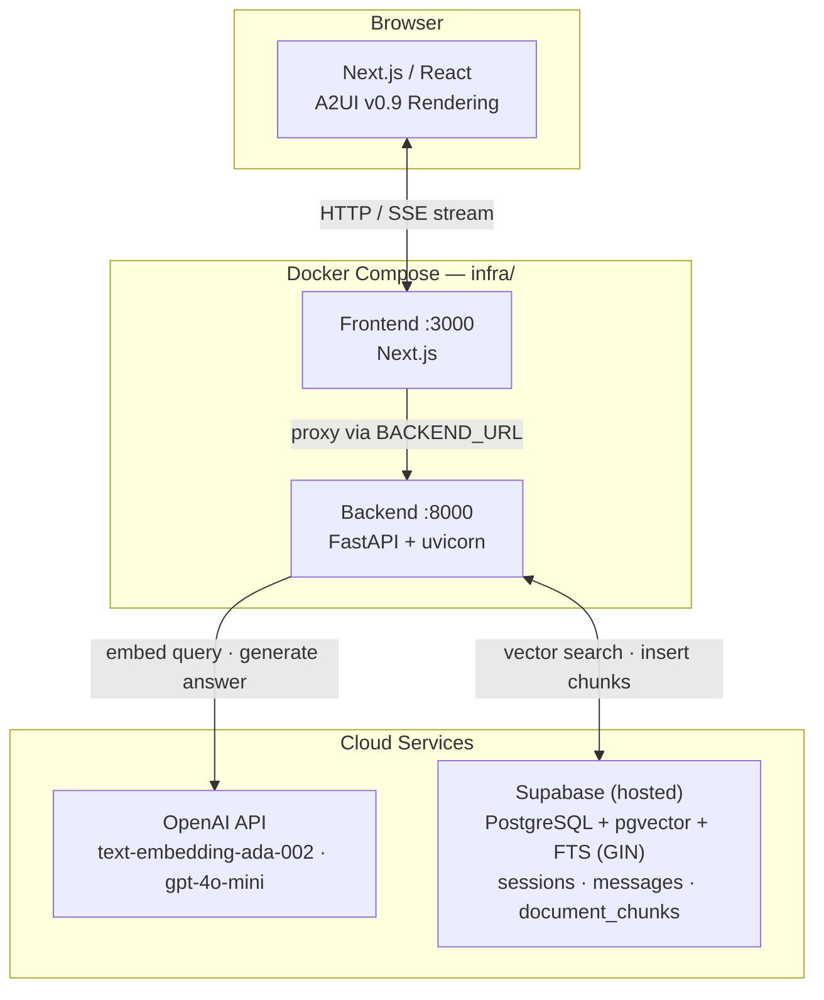
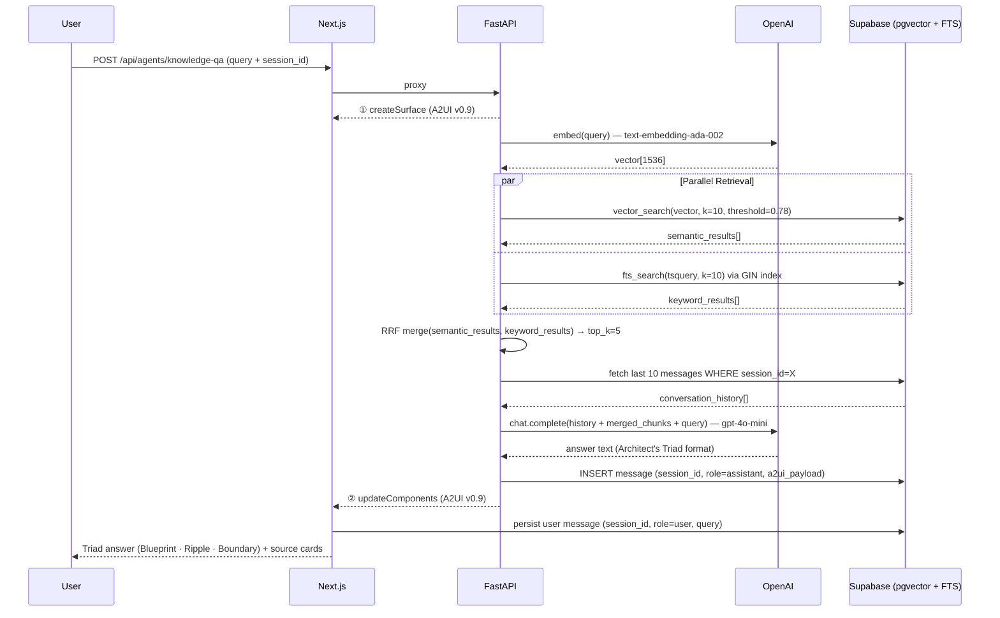
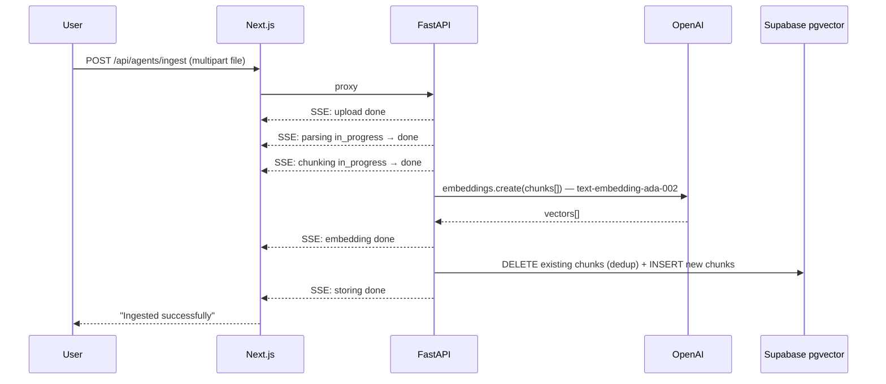

# A2UIPlatform Architecture Overview

**Last Updated:** April 11, 2026  
**Status:** v1.1 "Persistence & Precision" — Session persistence + multi-turn Q&A implemented; hybrid search and Architect's Triad planned

---

## 1. System Layers

```
┌─────────────────────────────────────────────────────────────────┐
│                          CLIENT (Browser)                       │
│  ┌─────────────────────────────────────────────────────────┐   │
│  │  FRONTEND (Next.js)                                     │   │
│  │  ┌──────────────────────────────────────────────────┐   │   │
│  │  │ PlatformShell (Nav + Surface Area)              │   │   │
│  │  ├──────────────────────────────────────────────────┤   │   │
│  │  │ Active App: KnowledgeQAApp                       │   │   │
│  │  │ ├─ DocumentDrawer (left sidebar, w-12↔w-80)    │   │   │
│  │  │ ├─ QueryInput (textarea) + ThinkingIndicator    │   │   │
│  │  │ └─ TurnView[] (one per query, latest on top)    │   │   │
│  │  │     └─ SurfaceView (surfaceId scoped)           │   │   │
│  │  │         └─ ComponentHost → Catalog components  │   │   │
│  │  └──────────────────────────────────────────────────┘   │   │
│  └─────────────────────────────────────────────────────────┘   │
└─────────────────────────────────────────────────────────────────┘
         │
         │ SSE (Server-Sent Events)
         │ POST /api/agents/knowledge-qa?query=...
         │ Content-Type: text/plain; charset=utf-8
         │ A2UI JSONL (createSurface, updateComponents)
         │
         ▼
┌─────────────────────────────────────────────────────────────────┐
│                    BACKEND (Python FastAPI)                     │
│  ┌─────────────────────────────────────────────────────────┐   │
│  │ POST /api/agents/knowledge-qa (query + session_id + surface_id) │
│  │  1. Validate query; read session_id + surface_id from params │
│  │  2. Stream Message 1: createSurface(surface_id)       │   │
│  │  3. PARALLEL: embed query + fetch last 10 history msgs│   │
│  │  4. pgvector similarity search (match_document_chunks)│   │
│  │  5. Filter chunks below MIN_SIMILARITY threshold      │   │
│  │  6. Build prompt with history block prepended         │   │
│  │  7. OpenAI gpt-4o-mini: generate answer               │   │
│  │  8. Stream Message 2: updateComponents(surface_id)    │   │
│  │  9. Background task: store_messages(session_id, ...)  │   │
│  │  10. Close SSE stream                                 │   │
│  │  [Phase 2] RRF hybrid search + Architect's Triad      │   │
│  └─────────────────────────────────────────────────────────┘   │
└─────────────────────────────────────────────────────────────────┘
         │
         │ pgvector queries + embeddings
         │
         ▼
┌─────────────────────────────────────────────────────────────────┐
│                    DATA LAYER (Supabase — hosted)               │
│  ┌─────────────────────────────────────────────────────────┐   │
│  │ pgvector embeddings table (document_chunks)            │   │
│  │   └─ GIN index on tsvector column (FTS)               │   │
│  │ documents table (title, excerpt, source)              │   │
│  │ sessions table (id, name, created_at, updated_at)     │   │
│  │ messages table (id, session_id, role, a2ui_payload)   │   │
│  │ Hybrid search: pgvector similarity + FTS via GIN      │   │
│  └─────────────────────────────────────────────────────────┘   │
└─────────────────────────────────────────────────────────────────┘
```

### System Architecture (Mermaid)



### Query Flow (v1.1 — Hybrid Search + Session Context)



### Ingestion Flow



---

## Governance & Rules

For detailed rules covering architecture constraints, code standards, layer boundaries, and import rules, see [Governance.md](Governance.md).

---

### Component Hierarchy

```
App Root (Next.js)
 │
 └─ PlatformShell (Layout)
     ├─ NavBar
     │  ├─ AppSwitcher (dropdown)
     │  └─ [+ Add App] (for future)
     │
     └─ Surface Area
        │
        └─ Active App (KnowledgeQAApp, etc.)
           ├─ QueryInput (app UI)
           ├─ StreamStatusBar (app UI)
           │
           └─ A2UISurface (A2UI layer — owned by MessageProcessor)
              │
              └─ ComponentHost
                 │
                 └─ Catalog Components (mapped from A2UI types)
                    ├─ TextComponent (h1/h2/h3/body/caption)
                    ├─ CardComponent (shadcn wrapper)
                    ├─ ButtonComponent (interaction)
                    ├─ BadgeComponent (metadata)
                    ├─ MarkdownComponent (react-markdown + GFM; [N] → citation badges)
                    └─ SourceListComponent (compact strip; registers sources via sourceRegistry)
```

### State Ownership (Critical)

| Layer | State Owner | Scope |
|---|---|---|
| **Platform** | `platformStore` (Zustand) | Current active app, global UI state |
| **A2UI Surface** | `MessageProcessor` (@a2ui/web_core/v0_9) | Component definitions, data bindings, rendering tree |
| **App** | Component local state (React hooks) | Query input, form state, validation |
| **HTTP** | None (SSE streaming only) | No polling, no persistent connection mgmt |

**Rule:** MessageProcessor is the single source of truth for surface state. Never duplicate it.

### Data Flow (Message Sequence)

```
1. User types query
   ↓
2. KnowledgeQAApp.onSubmit()
   ├─ Validate query
   ├─ useAgentStream.start(query)
   └─ Set status → STREAMING
   ↓
3. useAgentStream opens stream (fetch POST + ReadableStream)
   └─ Connects to: POST /api/agents/knowledge-qa?query=...&surface_id=qa-turn-<uuid>&session_id=<uuid>
   ↓
4. MessageProcessor receives messages (in order):
   │
   ├─ Message 1: createSurface
   │  └─ Registers: surfaceId="qa-turn-<uuid>", catalogId="stub"
   │
   └─ Message 2: updateComponents
      └─ Defines: [answer-label, answer-body, meta-info, sources-list]
         with final answer text + source objects (no sources-label — rendered by SourceListComponent)
   ↓
5. TurnView (per query) subscribes to its surfaceId via onSurfaceCreated
   ├─ SurfaceView renders when surface arrives
   ├─ Catalog components render with design tokens
   └─ User sees: latest turn at top; all prior turns below
   ↓
6. Stream closes; store_messages() fires as background task
   └─ Status → DONE
```

### Design System Integration

```
A2UI Component → usageHint (semantic hint) → Design Token
   Example:
   Text with usageHint: "h2"
     ↓
   TextComponent calls: getTokenForHint("h2")
     ↓
   Returns: { fontSize: "1.5rem", fontWeight: "700", color: "#1F2937" }
     ↓
   <h2 className="text-2xl font-bold text-gray-900">...</h2>
```

All styling driven by design tokens — defined as TypeScript constants in `src/a2ui/catalog/index.ts`.

---

## 3. Platform Shell Implementation (Frontend)

### Core Stack Decisions

**Why these choices?**

| Choice | Tech | Reason |
|---|---|---|
| **Framework** | React 19 + Next.js 16+ | SSR ready, App Router for clean routing, fast refresh |
| **Styling** | Tailwind CSS 4 + design tokens | Utility-first, design system integration, performant |
| **Components** | shadcn/ui (headless) | Composable, unstyled base for design token customization |
| **State** | Zustand (platform level) | Lightweight, minimal boilerplate, app registry management |
| **Protocol** | A2UI v0.9 via MessageProcessor | Decoupled UI layer, vendor-agnostic rendering |
| **Transport** | SSE (Server-Sent Events) | Streaming, simpler than WebSocket, unidirectional fits use case |

### Platform Shell Responsibilities

```
Next.js App Router
└─ Layout (root RootLayout)
   ├─ MessageProcessorProvider (context wrapper)
   ├─ PlatformShell (nav + surface area)
   │  ├─ AppSwitcher (route-aware nav)
   │  └─ Main content area
   │     └─ Current app (KnowledgeQAApp, etc.)
   │        └─ A2UISurface (MessageProcessor-driven rendering)
   │           └─ ComponentHost (type map → React)
   │              └─ Catalog components
   └─ [future: Auth, theme provider, etc.]
```

**What Platform Shell DOES:**
- Route-based app switching (`/knowledge-qa`, `/reflexive-brain`)
- Maintain `platformStore` (Zustand) for active app ID
- Provide navigation UI (AppSwitcher)
- Wrap `MessageProcessorProvider` (single processor instance)
- Host surface area for rendering

**What Platform Shell DOES NOT DO:**
- ❌ Import from `src/apps/` (stays app-agnostic)
- ❌ Know about specific app logic (RAG, LLM, etc.)
- ❌ Manage authentication (deferred to v2)
- ❌ Direct state mutations (apps own their state)

### A2UI Rendering Layer

**Flow:**
```
A2UI Protocol Message (JSONL)
  ↓
useAgentStream (SSE transporter)
  ↓
MessageProcessor (@a2ui/web_core/v0_9)
  ├─ Parse createSurface → creates surface model
  └─ Parse updateComponents → sets component definitions + props
  ↓
A2UISurface (React component)
  └─ Subscribes to MessageProcessor events
  └─ Renders SurfaceView per surface
     ↓
     ComponentHost (dynamic resolver)
     └─ Resolves A2UI component type → React component
        ↓
        Catalog component receives props + data bindings
        └─ TextComponent, CardComponent, ButtonComponent, etc.
           └─ Styled via designTokens.ts + Tailwind
```

**Key Rule:** MessageProcessor is the **single source of truth**. Apps never duplicate component state.

### Communication Layer (SSE)

**Why SSE over WebSocket/polling?**
- **Simpler:** Unidirectional (server → browser only)
- **Native:** No library needed (fetch + ReadableStream)
- **Stateless:** Each connection independent, easy to close
- **Fit:** Perfect for inference streaming (think: LLM token-by-token)

**Implementation:**
```
useSSE hook:
├─ Opens fetch() POST with AbortController
├─ Reads response.body as ReadableStream
└─ Parses newline-delimited JSON

useAgentStream hook (uses useSSE):
├─ Calls useSSE to open stream
├─ Feeds each line to MessageProcessor
└─ Updates React state (status: IDLE/STREAMING/DONE/ERROR)
```

**Resource Management:**
- Explicit `.abort()` on route change (prevent leaks)
- Single connection per query (no pooling)
- Auto-close after stream ends (FE reads until `done` signal from ReadableStream)

### Design System Integration

**Token-Driven UI:**
```typescript
// designTokens.ts (single source)
export const designTokens = {
  colors: { primary: '#3B82F6', error: '#EF4444', ... },
  typography: { h1: { fontSize: '2.25rem', ... }, ... },
  spacing: { xs: '0.5rem', md: '1rem', ... }
}

// Component usage
<h2 className="text-3xl font-bold text-gray-900">  // Tokens applied
```

**Propagation:**
```
A2UI Prop (usageHint: "h2")
  ↓
TextComponent.getTokenForHint("h2")
  ↓
designTokens.typography.h2
  ↓
Tailwind className: "text-3xl font-bold text-gray-900"
  ↓
Rendered HTML with design token styling
```

---

## 3. v1.1 Feature Architecture

### 3.1 Session Persistence

#### Supabase Schema

```sql
-- Session metadata
CREATE TABLE sessions (
  id          UUID PRIMARY KEY DEFAULT gen_random_uuid(),
  name        TEXT NOT NULL DEFAULT 'New Session',
  created_at  TIMESTAMPTZ NOT NULL DEFAULT now(),
  updated_at  TIMESTAMPTZ NOT NULL DEFAULT now()
);

-- Full A2UI message log (one row per turn)
CREATE TABLE messages (
  id          UUID PRIMARY KEY DEFAULT gen_random_uuid(),
  session_id  UUID NOT NULL REFERENCES sessions(id) ON DELETE CASCADE,
  role        TEXT NOT NULL CHECK (role IN ('user', 'assistant')),
  content     TEXT,            -- raw query text (user turns)
  a2ui_payload JSONB,          -- full A2UI updateComponents payload (assistant turns)
  created_at  TIMESTAMPTZ NOT NULL DEFAULT now()
);

CREATE INDEX idx_messages_session ON messages(session_id, created_at);
```

#### Hydration Process

When a user reopens a session the frontend reconstructs the full surface from stored JSON:

```
Session selected by user
  ↓
FE: GET /api/sessions/{session_id}/messages
  ↓
BE: SELECT * FROM messages WHERE session_id = X ORDER BY created_at ASC
  ↓
FE: for each assistant message
      MessageProcessor.process(message.a2ui_payload)   ← replay stored A2UI JSONL
  ↓
A2UISurface re-renders each turn in sequence
  ↓
User sees full conversation history, fully styled (design tokens applied)
```

**Key constraint (A2UI v0.9):** Hydration replays the stored `updateComponents` payloads through MessageProcessor. The UI is reconstructed from protocol messages, not raw text — ensuring design-token styling is preserved exactly as at query time.

**Context window:** The backend sends only the **last 10 messages** as LLM history to bound token usage. All messages are stored in full but only the recent window is included in the prompt.

---

### 3.2 Hybrid Search (Retrieval)

#### Why Hybrid Search?

Pure vector search misses exact-match technical terms (acronyms, model names, version strings) where keyword frequency matters more than semantic proximity. Hybrid search combines both signals before the LLM sees any context.

#### Supabase FTS Setup

```sql
-- Add FTS column to document_chunks
ALTER TABLE document_chunks
  ADD COLUMN fts_vector TSVECTOR
    GENERATED ALWAYS AS (to_tsvector('english', content)) STORED;

-- GIN index for fast full-text queries
CREATE INDEX idx_chunks_fts ON document_chunks USING GIN(fts_vector);
```

#### Hybrid Search RPC

```sql
-- Supabase RPC: hybrid_search_chunks
CREATE OR REPLACE FUNCTION hybrid_search_chunks(
  query_text    TEXT,
  query_vector  VECTOR(1536),
  match_count   INT DEFAULT 10
)
RETURNS TABLE (
  id            UUID,
  content       TEXT,
  metadata      JSONB,
  vector_rank   INT,
  fts_rank      INT
)
LANGUAGE plpgsql AS $$
BEGIN
  RETURN QUERY
  WITH vector_hits AS (
    SELECT id,
           ROW_NUMBER() OVER (ORDER BY embedding <#> query_vector) AS rank
    FROM document_chunks
    ORDER BY embedding <#> query_vector
    LIMIT match_count
  ),
  fts_hits AS (
    SELECT id,
           ROW_NUMBER() OVER (ORDER BY ts_rank(fts_vector, query) DESC) AS rank
    FROM document_chunks,
         plainto_tsquery('english', query_text) query
    WHERE fts_vector @@ query
    ORDER BY ts_rank(fts_vector, query) DESC
    LIMIT match_count
  )
  SELECT dc.id, dc.content, dc.metadata,
         COALESCE(vh.rank, match_count + 1)::INT AS vector_rank,
         COALESCE(fh.rank, match_count + 1)::INT AS fts_rank
  FROM document_chunks dc
  LEFT JOIN vector_hits vh ON dc.id = vh.id
  LEFT JOIN fts_hits    fh ON dc.id = fh.id
  WHERE vh.id IS NOT NULL OR fh.id IS NOT NULL;
END;
$$;
```

#### Reciprocal Rank Fusion (RRF) — Python

```python
# agents/knowledge_qa_agent.py
RRF_K = 60  # dampening constant

def rrf_merge(rows: list[dict], top_k: int = 5) -> list[dict]:
    """Fuse vector and FTS ranked lists using Reciprocal Rank Fusion."""
    scored = []
    for row in rows:
        score = (1 / (RRF_K + row["vector_rank"])) + \
                (1 / (RRF_K + row["fts_rank"]))
        scored.append({**row, "rrf_score": score})
    scored.sort(key=lambda x: x["rrf_score"], reverse=True)
    return scored[:top_k]
```

**Flow:** `hybrid_search_chunks` RPC → Python `rrf_merge()` → top-5 chunks passed to `gpt-4o-mini`.

---

### 3.3 The Architect's Triad (Synthesizer Format)

All Knowledge-QA answers are structured as a three-part format. The LLM is prompted to produce this layout; the backend maps each section to an A2UI component tree.

| Section | Label | Purpose |
|---|---|---|
| **The Blueprint** | Core Concept | What the thing *is* — the canonical, precise definition |
| **The Systemic Ripple** | Architectural Impact | How it interacts with and changes surrounding systems |
| **The Boundary Condition** | Constraints & Trade-offs | Where it breaks down, what it can't do, its known limits |

**A2UI mapping (inside `updateComponents`):**

```
[TextComponent h2]  "The Blueprint"
[MarkdownComponent] <core concept text>
[TextComponent h2]  "The Systemic Ripple"
[MarkdownComponent] <architectural impact text>
[TextComponent h2]  "The Boundary Condition"
[MarkdownComponent] <constraints text>
[SourceListComponent] sources[]
```

**LLM system prompt fragment:**

```
Structure every answer using exactly these three sections:
## The Blueprint
<Precise definition and core concept. No padding.>
## The Systemic Ripple
<How this concept propagates through surrounding architecture, data flows, or dependencies.>
## The Boundary Condition
<Where this breaks down. Hard limits, known failure modes, and trade-off decisions.>
```

---

## 3. Backend Architecture (v1 — Implemented)

### Request/Response Contract

```
POST /api/agents/knowledge-qa?query=<string>[&category=...][&dateFrom=...][&dateTo=...]

Response:
Content-Type: text/plain; charset=utf-8
Cache-Control: no-cache, no-store

Message 1: {"version":"v0.9","createSurface":{"surfaceId":"qa-turn-<uuid>","catalogId":"stub"}}
Message 2: {"version":"v0.9","updateComponents":{"surfaceId":"qa-turn-<uuid>","components":[...]}}

Stream closes after Message 2.
```

**Full spec:** See [Contracts.md](Contracts.md) § 1-9.

### Python Service Stack

- **Framework:** FastAPI + uvicorn
- **Embedding:** OpenAI `text-embedding-ada-002` (1536-dim)
- **Vector Store:** Supabase pgvector (`match_document_chunks` RPC)
- **Full-Text Search:** Supabase PostgreSQL FTS via GIN index on `tsvector` column
- **Retrieval:** Hybrid search RPC (`hybrid_search_chunks`) + RRF merge in Python
- **LLM:** OpenAI `gpt-4o-mini` via OpenAI SDK
- **Session Store:** Supabase `sessions` + `messages` tables (JSONB payload)
- **Proxy:** Next.js route handler proxies to FastAPI when `BACKEND_URL` is set

### Integration: Next.js → FastAPI

```
Browser → POST /api/agents/knowledge-qa?...
           ↓ (Next.js route handler)
           If BACKEND_URL set: proxy to FastAPI (localhost:8000)
           Else: mock response (dev/no-backend mode)
```

### Project Layout

```
backend/
├── main.py                      FastAPI app + CORS + health check
├── requirements.txt
├── app/
│   ├── config.py                Env var loading
│   ├── a2ui/messages.py         A2UI v0.9 message builders
│   └── routes/
│       ├── knowledge_qa.py      POST /api/agents/knowledge-qa (+ session_id)
│       ├── sessions.py          GET/POST/DELETE /api/sessions
│       └── ingest.py            POST /api/agents/ingest
└── agents/
    ├── knowledge_qa_agent.py    Embed → hybrid_search_chunks → RRF → history → chat → Triad
    └── ingest_agent.py          Parse → chunk → embed → store (SSE progress)
```

---

## 4. Infrastructure (v1 — Implemented)

### Docker Compose (`infra/docker-compose.yml`)

Two profiles — `dev` (hot-reload, volume mounts) and `prod` (optimised builds, no mounts):

```
infra/
└── docker-compose.yml    --profile dev | --profile prod

frontend/
├── Dockerfile            dev: npm run dev (predev → tokens → next dev)
└── .dockerignore         prod: multi-stage → Next.js standalone output

backend/
├── Dockerfile            dev: python main.py (uvicorn --reload)
└── .dockerignore         prod: uvicorn workers, code baked in
```

**Usage (via Makefile at repo root):**
```bash
cp .env.example .env   # fill in OPENAI_API_KEY, SUPABASE_URL, SUPABASE_ANON_KEY

make dev               # start everything: FE + BE + observability sidecar
make dev-d             # same but detached (runs in background)
make down              # stop all containers
make logs-be           # tail backend logs
make ps                # show container status
make help              # list all available targets
```

### Service Access URLs

| Service | URL | Notes |
|---|---|---|
| **Frontend (Knowledge QA)** | http://localhost:3000 | Next.js app |
| **Backend API** | http://localhost:8000 | FastAPI — health: `/health` |
| **Backend Metrics** | http://localhost:8000/metrics | Prometheus scrape endpoint |
| **Grafana** | http://localhost:3001 | No login — anonymous admin |
| **Prometheus** | http://localhost:9090 | Metrics + exemplars |
| **Loki** | http://localhost:3100 | Log aggregation (query via Grafana) |
| **Tempo** | http://localhost:3200 | Distributed traces (query via Grafana) |
| **OTel Collector** | http://localhost:8888/metrics | Collector self-metrics |

---

### Observability Stack (v1.1 — Implemented)

The LGTM sidecar is bundled into `make dev` and runs automatically alongside the application.

#### Architecture

```
Browser (Next.js)
  │  generates W3C traceparent header per SSE request
  │  reads X-Trace-ID from response headers
  ▼
Next.js API Route (/api/agents/knowledge-qa)
  │  forwards traceparent upstream
  │  relays X-Trace-ID downstream
  ▼
FastAPI Backend (port 8000)
  │  FastAPIInstrumentor extracts traceparent → creates root HTTP span
  │  structlog emits JSON logs with trace_id + span_id on every line
  │  RAG pipeline: 4 named child spans
  │    ├─ embed_query       (gen_ai.system=openai, gen_ai.request.model=ada-002)
  │    ├─ hybrid_retrieval  (db.system=postgresql, synapse.retrieval.chunks_returned=N)
  │    ├─ llm_completion    (gen_ai.usage.total_tokens=N)
  │    └─ stream_response   (synapse.response.sources_count=N)
  │  /metrics endpoint → synapse_rag_step_duration_seconds histogram
  ▼
OTel Collector (ports 4317 gRPC / 4318 HTTP)
  ├─ traces → Grafana Tempo (port 3200)
  └─ logs   → Grafana Loki  (port 3100)
  ▼
Grafana (port 3001)
  ├─ Explore → Tempo   → trace waterfall for any query
  ├─ Explore → Loki    → structured JSON logs; click trace_id → jump to Tempo
  └─ Explore → Prometheus → RAG step latency histogram + exemplars → jump to slow trace
```

#### Key Files

```
infra/
├── docker-compose.observability.yml   LGTM services + backend env var overrides
├── otel-collector-config.yaml         Receiver (OTLP) → exporters (Tempo + Loki)
├── tempo-config.yaml                  Tempo: local storage, 72h retention
├── loki-config.yaml                   Loki: single-node, zone awareness disabled
├── prometheus.yml                     Scrape: backend /metrics + collector self-metrics
└── grafana/provisioning/
    └── datasources/lgtm.yaml          Auto-provisions Loki + Tempo + Prometheus
                                       with cross-linking (log→trace, trace→log, metric→trace)

backend/
└── app/telemetry/
    ├── __init__.py                    Public re-exports
    └── logger.py                      OTel TracerProvider + LoggerProvider + MeterProvider
                                       structlog JSON chain + stdlib logging bridge
```

#### Grafana Quick-Start

1. Open **http://localhost:3001**
2. Click **Explore** (compass icon, left sidebar)
3. **Traces:** select *Tempo* datasource → Search → filter `service.name = synapse-backend` → run a query in the app → traces appear in seconds
4. **Logs:** select *Loki* datasource → Label filter `service_name = synapse-backend` → click any log line → "View Trace in Tempo" link appears inline
5. **Metrics:** select *Prometheus* datasource → query `synapse_rag_step_duration_seconds_bucket` → view per-step latency histogram

#### Trace Propagation Flow

```
useSSE.ts (browser)
  → generates: traceparent: 00-{32hex}-{16hex}-01
  → fetch POST /api/agents/knowledge-qa
      ↓
Next.js proxy
  → forwards: traceparent header
  → fetch POST http://backend:8000/api/agents/knowledge-qa
      ↓
FastAPI (FastAPIInstrumentor)
  → extracts traceparent → sets as parent context
  → creates HTTP root span (child of frontend trace)
  → all RAG spans are grandchildren of the same trace
  → response header: X-Trace-ID: {32hex}
      ↓
Next.js proxy
  → relays: X-Trace-ID header back to browser
      ↓
useSSE.ts → onTraceId callback fires with confirmed trace ID
```

**Result:** A single trace ID links the browser request → Next.js proxy → FastAPI HTTP span → embed_query → hybrid_retrieval → llm_completion → stream_response. All visible in one Tempo trace waterfall.

### Deployment (Future)

- **FE:** Vercel (Next.js native)
- **BE:** Railway or Fly.io (Python FastAPI)
- **DB:** Supabase managed pgvector (already hosted)
- **IaC:** Terraform (`infra/terraform/`)

---

## 5. Communication Contracts

### FE → BE (v1.1: FastAPI with session support)

**Input (URL query params):**
- `query` (string, required)
- `session_id` (UUID string, optional — omit to start a new session)
- `category` (string, optional)
- `dateFrom` (string, optional, YYYY-MM-DD)
- `dateTo` (string, optional, YYYY-MM-DD)

**Output (Streaming JSONL):**
```
Line 1: createSurface
Line 2: updateComponents
```

### A2UI Message Schema (v0.9)

See [A2UI_Specification.md](A2UI_Specification.md) § A2UI v0.9 Message Reference.

---

## 6. Scalability Patterns (Future)

### Multi-App Routing
```
AppRegistry
├─ KnowledgeQAApp  (v1)
├─ ChatbotApp      (planned v2)
├─ AnalyticsApp    (planned v2)
└─ ...
```
New apps added to AppRegistry only. No root changes.

### Catalog Extensibility
```
src/a2ui/catalog/components/
├─ TextComponent       (v1 — h1/h2/h3/body/caption hints)
├─ CardComponent       (v1)
├─ ButtonComponent     (v1)
├─ BadgeComponent      (v1)
├─ SourceListComponent (v1 — compact citation strip; registers sources via sourceRegistry)
├─ MetadataCard        (v1 — document/section/date/category)
├─ MarkdownComponent   (v1 — react-markdown + GFM; [N] patterns → clickable citation badges)
├─ ConfidenceBadge     (v1 UI helper — Strong/Good/Relevant/Partial tiers; used by Drawer)
├─ ImageComponent      (v2+)
├─ FormComponent       (v2+)
└─ ...
```
New components added to catalog + registered in ComponentHost. No renderer changes.

### Design Token Scaling
```
src/a2ui/catalog/designTokens.ts

export const designTokens = {
  colors: { primary, secondary, success, warning, error, ... },
  typography: { h1, h2, h3, body, caption, ... },
  spacing: { xs, sm, md, lg, xl, ... },
  shadows: { sm, md, lg, ... },
}
```
All shadcn overrides + Tailwind config driven from this single file.

---

## 7. Cross-Layer Contracts (What Each Layer Owns)

| Concern | Owner | Responsibility |
|---|---|---|
| User intent (query) | Frontend | Capture + validate |
| Agent logic (RAG, LLM) | Backend | Generate A2UI surface |
| A2UI protocol compliance | Backend | Stream valid JSONL |
| Message transport (SSE) | Frontend | Open/close stream via fetch, handle errors |
| State management (MessageProcessor) | Frontend | Receive messages, update internal state |
| UI rendering (React) | Frontend | Map A2UI → React components + tokens |
| Design system (tokens) | Frontend | Define + apply consistently |

**No Layer Owns:** Authentication, authorization, persistence (all optional in v1).

---

## 8. Error Handling

See [Contracts.md §6](Contracts.md) for backend error shapes and [Governance.md §Error Handling Rules](Governance.md) for FE rules.

---

## 9. Version Status & Next Priorities

### v1.0 — Complete ✅

- [x] **FE:** Platform Shell, Knowledge-QA app, A2UI v0.9, SSE streaming, catalog components
- [x] **BE:** FastAPI, RAG query pipeline, document ingestion pipeline, health endpoint
- [x] **DB:** Supabase operational — pgvector, `document_chunks` table, `match_document_chunks` RPC
- [x] **Infra:** Docker Compose (`dev` + `prod` profiles), multi-stage Dockerfiles
- [x] **Observability:** LGTM sidecar (Loki + Grafana + Tempo + Prometheus), OTel distributed tracing, structlog JSON logging, W3C trace propagation, RAG step histograms

### v1.1 — "Persistence & Precision" (In Progress)

- [ ] **Session Persistence:** `sessions` + `messages` tables; create/name/delete sessions; 10-message context window
- [ ] **Session Hydration:** FE replays stored `a2ui_payload` through MessageProcessor on session resume
- [ ] **Hybrid Search:** GIN FTS index on `document_chunks.fts_vector`; `hybrid_search_chunks` RPC; Python RRF merge
- [ ] **Architect's Triad:** LLM prompt template + A2UI component mapping for Blueprint/Ripple/Boundary format
- [ ] **Sessions API:** `GET/POST/DELETE /api/sessions` endpoints

### v2.0 — Next

- [ ] **Reflexive-Brain app** — quick capture, global search, agentic triage
- [ ] **Auth:** Real OAuth/SAML replacing the v1 bypass on `/ingest`
- [ ] **Implicit Ingestion** — automated watcher for cloud/local folder sync

**Architecture decisions (locked):**
- LLM: OpenAI `gpt-4o-mini`
- Embeddings: OpenAI `text-embedding-ada-002`
- Vector store: Supabase pgvector + FTS (GIN)
- Retrieval: Hybrid search (RRF fusion)
- Orchestration: Direct SDK calls (no LangChain)
- Transport: SSE over plain fetch (no WebSocket)
- Session storage: Supabase PostgreSQL (JSONB payloads)

---

*This document is conceptual. For implementation details, see [Product_Requirements.md](Product_Requirements.md) (business rules) and [Contracts.md](Contracts.md) (interface specs).*
