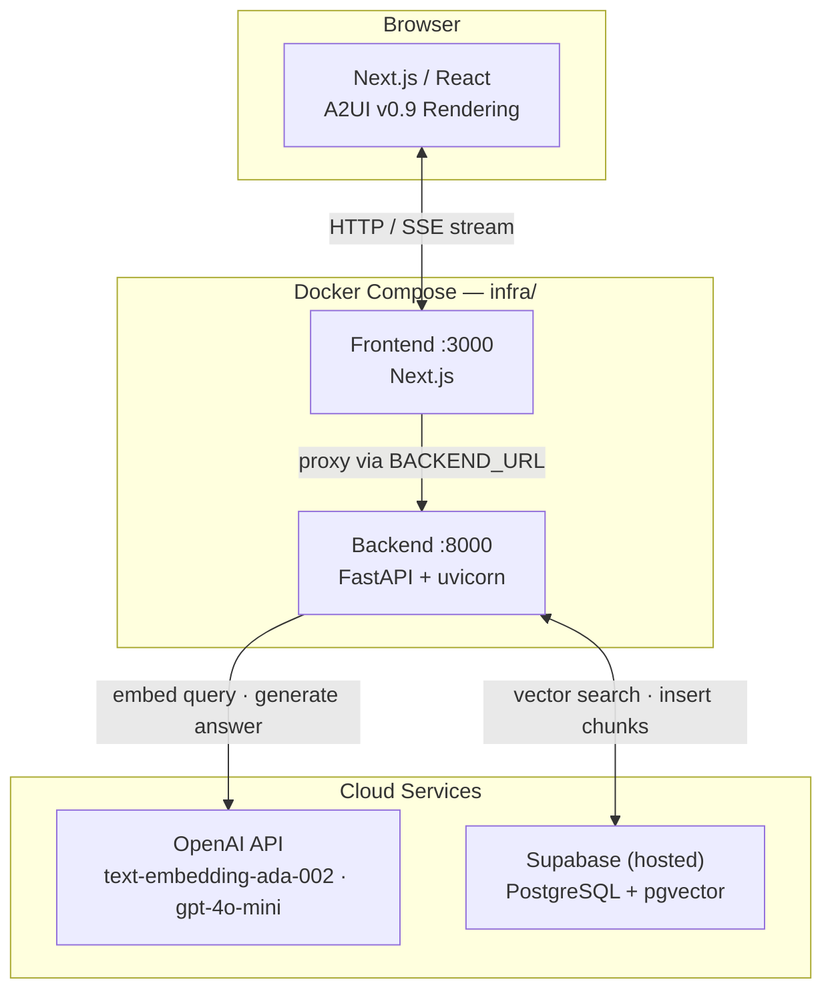
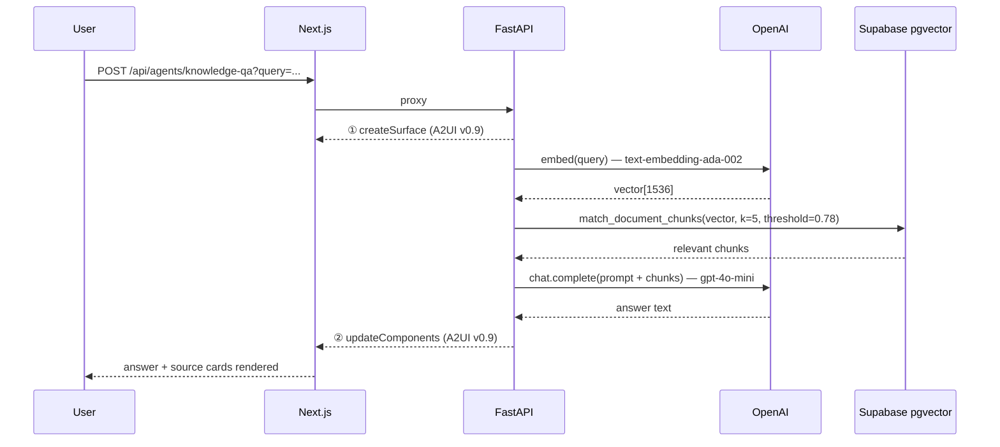
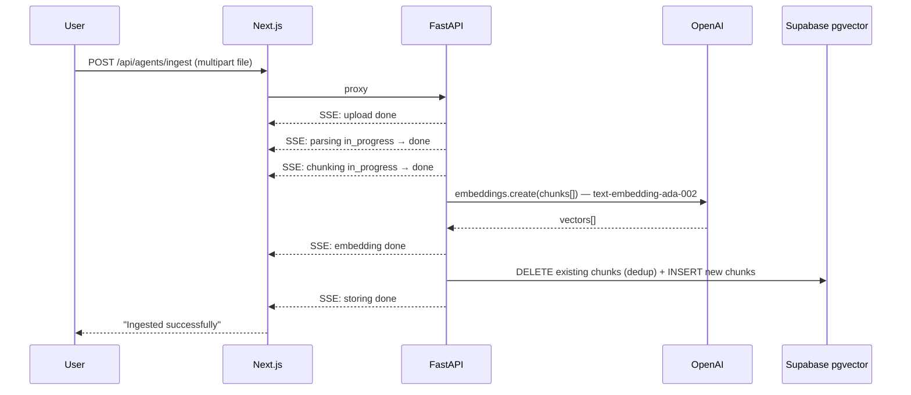

# A2UIPlatform Architecture Overview

**Last Updated:** April 10, 2026  
**Status:** v1.0 complete — FE, BE, and Infra all implemented and operational

---

## 1. System Layers

```
┌─────────────────────────────────────────────────────────────────┐
│                          CLIENT (Browser)                       │
│  ┌─────────────────────────────────────────────────────────┐   │
│  │  FRONTEND (Next.js)                                     │   │
│  │  ┌──────────────────────────────────────────────────┐   │   │
│  │  │ PlatformShell (Nav + Surface Area)              │   │   │
│  │  ├──────────────────────────────────────────────────┤   │   │
│  │  │ Active App: KnowledgeQAApp                       │   │   │
│  │  │ ├─ QueryInput (textarea)                        │   │   │
│  │  │ └─ A2UISurface (MessageProcessor → React)       │   │   │
│  │  │     └─ ComponentHost (type → component mapper)  │   │   │
│  │  │        └─ Catalog (Text/Card/Button/Badge/...)  │   │   │
│  │  └──────────────────────────────────────────────────┘   │   │
│  └─────────────────────────────────────────────────────────┘   │
└─────────────────────────────────────────────────────────────────┘
         │
         │ SSE (Server-Sent Events)
         │ POST /api/agents/knowledge-qa?query=...
         │ Content-Type: text/plain; charset=utf-8
         │ A2UI JSONL (createSurface, updateComponents)
         │
         ▼
┌─────────────────────────────────────────────────────────────────┐
│                    BACKEND (Python FastAPI)                     │
│  ┌─────────────────────────────────────────────────────────┐   │
│  │ POST /api/agents/knowledge-qa?query=...               │   │
│  │  1. Validate query + read filter params               │   │
│  │  2. Stream Message 1: createSurface                   │   │
│  │  3. OpenAI: embed query (text-embedding-ada-002)      │   │
│  │  4. Supabase pgvector: similarity search              │   │
│  │  5. OpenAI gpt-4o-mini: generate answer from context  │   │
│  │  6. Stream Message 2: updateComponents                │   │
│  │  7. Close SSE stream                                  │   │
│  └─────────────────────────────────────────────────────────┘   │
└─────────────────────────────────────────────────────────────────┘
         │
         │ pgvector queries + embeddings
         │
         ▼
┌─────────────────────────────────────────────────────────────────┐
│                    DATA LAYER (Supabase — hosted)               │
│  ┌─────────────────────────────────────────────────────────┐   │
│  │ pgvector embeddings table                              │   │
│  │ documents table (title, excerpt, source)              │   │
│  │ Semantic search via koalas library                    │   │
│  └─────────────────────────────────────────────────────────┘   │
└─────────────────────────────────────────────────────────────────┘
```

### System Architecture (Mermaid)



### Query Flow



### Ingestion Flow



---

## Governance & Rules

For detailed rules covering architecture constraints, code standards, layer boundaries, and import rules, see [Governance.md](Governance.md).

---

### Component Hierarchy

```
App Root (Next.js)
 │
 └─ PlatformShell (Layout)
     ├─ NavBar
     │  ├─ AppSwitcher (dropdown)
     │  └─ [+ Add App] (for future)
     │
     └─ Surface Area
        │
        └─ Active App (KnowledgeQAApp, etc.)
           ├─ QueryInput (app UI)
           ├─ StreamStatusBar (app UI)
           │
           └─ A2UISurface (A2UI layer — owned by MessageProcessor)
              │
              └─ ComponentHost
                 │
                 └─ Catalog Components (mapped from A2UI types)
                    ├─ TextComponent (h1/h2/h3/body/caption)
                    ├─ CardComponent (shadcn wrapper)
                    ├─ ButtonComponent (interaction)
                    ├─ BadgeComponent (metadata)
                    ├─ MarkdownComponent (react-markdown + GFM; [N] → citation badges)
                    └─ SourceListComponent (compact strip; registers sources via sourceRegistry)
```

### State Ownership (Critical)

| Layer | State Owner | Scope |
|---|---|---|
| **Platform** | `platformStore` (Zustand) | Current active app, global UI state |
| **A2UI Surface** | `MessageProcessor` (@a2ui/web_core/v0_9) | Component definitions, data bindings, rendering tree |
| **App** | Component local state (React hooks) | Query input, form state, validation |
| **HTTP** | None (SSE streaming only) | No polling, no persistent connection mgmt |

**Rule:** MessageProcessor is the single source of truth for surface state. Never duplicate it.

### Data Flow (Message Sequence)

```
1. User types query
   ↓
2. KnowledgeQAApp.onSubmit()
   ├─ Validate query
   ├─ useAgentStream.start(query)
   └─ Set status → STREAMING
   ↓
3. useAgentStream opens stream (fetch POST + ReadableStream)
   └─ Connects to: POST /api/agents/knowledge-qa?query=...
   ↓
4. MessageProcessor receives messages (in order):
   │
   ├─ Message 1: createSurface
   │  └─ Registers: surfaceId="qa-result", catalogId="stub"
   │
   └─ Message 2: updateComponents
      └─ Defines: [answer-label, answer-body, sources-label, sources-list]
         with final answer text + source objects
   ↓
5. A2UISurface re-renders from processor state
   ├─ ComponentHost resolves types to React components
   ├─ Each component gets props from processor
   ├─ Catalog components render with design tokens
   └─ User sees: Answer text + Source cards
   ↓
6. Stream closes
   └─ Status → DONE
```

### Design System Integration

```
A2UI Component → usageHint (semantic hint) → Design Token
   Example:
   Text with usageHint: "h2"
     ↓
   TextComponent calls: getTokenForHint("h2")
     ↓
   Returns: { fontSize: "1.5rem", fontWeight: "700", color: "#1F2937" }
     ↓
   <h2 className="text-2xl font-bold text-gray-900">...</h2>
```

All styling driven by design tokens — defined as TypeScript constants in `src/a2ui/catalog/index.ts`.

---

## 3. Platform Shell Implementation (Frontend)

### Core Stack Decisions

**Why these choices?**

| Choice | Tech | Reason |
|---|---|---|
| **Framework** | React 19 + Next.js 16+ | SSR ready, App Router for clean routing, fast refresh |
| **Styling** | Tailwind CSS 4 + design tokens | Utility-first, design system integration, performant |
| **Components** | shadcn/ui (headless) | Composable, unstyled base for design token customization |
| **State** | Zustand (platform level) | Lightweight, minimal boilerplate, app registry management |
| **Protocol** | A2UI v0.9 via MessageProcessor | Decoupled UI layer, vendor-agnostic rendering |
| **Transport** | SSE (Server-Sent Events) | Streaming, simpler than WebSocket, unidirectional fits use case |

### Platform Shell Responsibilities

```
Next.js App Router
└─ Layout (root RootLayout)
   ├─ MessageProcessorProvider (context wrapper)
   ├─ PlatformShell (nav + surface area)
   │  ├─ AppSwitcher (route-aware nav)
   │  └─ Main content area
   │     └─ Current app (KnowledgeQAApp, etc.)
   │        └─ A2UISurface (MessageProcessor-driven rendering)
   │           └─ ComponentHost (type map → React)
   │              └─ Catalog components
   └─ [future: Auth, theme provider, etc.]
```

**What Platform Shell DOES:**
- Route-based app switching (`/knowledge-qa`, `/reflexive-brain`)
- Maintain `platformStore` (Zustand) for active app ID
- Provide navigation UI (AppSwitcher)
- Wrap `MessageProcessorProvider` (single processor instance)
- Host surface area for rendering

**What Platform Shell DOES NOT DO:**
- ❌ Import from `src/apps/` (stays app-agnostic)
- ❌ Know about specific app logic (RAG, LLM, etc.)
- ❌ Manage authentication (deferred to v2)
- ❌ Direct state mutations (apps own their state)

### A2UI Rendering Layer

**Flow:**
```
A2UI Protocol Message (JSONL)
  ↓
useAgentStream (SSE transporter)
  ↓
MessageProcessor (@a2ui/web_core/v0_9)
  ├─ Parse createSurface → creates surface model
  └─ Parse updateComponents → sets component definitions + props
  ↓
A2UISurface (React component)
  └─ Subscribes to MessageProcessor events
  └─ Renders SurfaceView per surface
     ↓
     ComponentHost (dynamic resolver)
     └─ Resolves A2UI component type → React component
        ↓
        Catalog component receives props + data bindings
        └─ TextComponent, CardComponent, ButtonComponent, etc.
           └─ Styled via designTokens.ts + Tailwind
```

**Key Rule:** MessageProcessor is the **single source of truth**. Apps never duplicate component state.

### Communication Layer (SSE)

**Why SSE over WebSocket/polling?**
- **Simpler:** Unidirectional (server → browser only)
- **Native:** No library needed (fetch + ReadableStream)
- **Stateless:** Each connection independent, easy to close
- **Fit:** Perfect for inference streaming (think: LLM token-by-token)

**Implementation:**
```
useSSE hook:
├─ Opens fetch() POST with AbortController
├─ Reads response.body as ReadableStream
└─ Parses newline-delimited JSON

useAgentStream hook (uses useSSE):
├─ Calls useSSE to open stream
├─ Feeds each line to MessageProcessor
└─ Updates React state (status: IDLE/STREAMING/DONE/ERROR)
```

**Resource Management:**
- Explicit `.abort()` on route change (prevent leaks)
- Single connection per query (no pooling)
- Auto-close after stream ends (FE reads until `done` signal from ReadableStream)

### Design System Integration

**Token-Driven UI:**
```typescript
// designTokens.ts (single source)
export const designTokens = {
  colors: { primary: '#3B82F6', error: '#EF4444', ... },
  typography: { h1: { fontSize: '2.25rem', ... }, ... },
  spacing: { xs: '0.5rem', md: '1rem', ... }
}

// Component usage
<h2 className="text-3xl font-bold text-gray-900">  // Tokens applied
```

**Propagation:**
```
A2UI Prop (usageHint: "h2")
  ↓
TextComponent.getTokenForHint("h2")
  ↓
designTokens.typography.h2
  ↓
Tailwind className: "text-3xl font-bold text-gray-900"
  ↓
Rendered HTML with design token styling
```

---

## 3. Backend Architecture (v1 — Implemented)

### Request/Response Contract

```
POST /api/agents/knowledge-qa?query=<string>[&category=...][&dateFrom=...][&dateTo=...]

Response:
Content-Type: text/plain; charset=utf-8
Cache-Control: no-cache, no-store

Message 1: {"version":"v0.9","createSurface":{"surfaceId":"qa-result","catalogId":"stub"}}
Message 2: {"version":"v0.9","updateComponents":{"surfaceId":"qa-result","components":[...]}}

Stream closes after Message 2.
```

**Full spec:** See [Contracts.md](Contracts.md) § 1-9.

### Python Service Stack

- **Framework:** FastAPI + uvicorn
- **Embedding:** OpenAI `text-embedding-ada-002` (1536-dim)
- **Vector Store:** Supabase pgvector (`match_document_chunks` RPC)
- **LLM:** OpenAI `gpt-4o-mini` via OpenAI SDK
- **Proxy:** Next.js route handler proxies to FastAPI when `BACKEND_URL` is set

### Integration: Next.js → FastAPI

```
Browser → POST /api/agents/knowledge-qa?...
           ↓ (Next.js route handler)
           If BACKEND_URL set: proxy to FastAPI (localhost:8000)
           Else: mock response (dev/no-backend mode)
```

### Project Layout

```
backend/
├── main.py                      FastAPI app + CORS + health check
├── requirements.txt
├── app/
│   ├── config.py                Env var loading
│   ├── a2ui/messages.py         A2UI v0.9 message builders
│   └── routes/
│       ├── knowledge_qa.py      POST /api/agents/knowledge-qa
│       └── ingest.py            POST /api/agents/ingest
└── agents/
    ├── knowledge_qa_agent.py    Embed → similarity search → chat → sources
    └── ingest_agent.py          Parse → chunk → embed → store (SSE progress)
```

---

## 4. Infrastructure (v1 — Implemented)

### Docker Compose (`infra/docker-compose.yml`)

Two profiles — `dev` (hot-reload, volume mounts) and `prod` (optimised builds, no mounts):

```
infra/
└── docker-compose.yml    --profile dev | --profile prod

frontend/
├── Dockerfile            dev: npm run dev (predev → tokens → next dev)
└── .dockerignore         prod: multi-stage → Next.js standalone output

backend/
├── Dockerfile            dev: python main.py (uvicorn --reload)
└── .dockerignore         prod: uvicorn workers, code baked in
```

**Usage:**
```bash
cp .env.example .env      # fill in OPENAI_API_KEY, SUPABASE_URL, SUPABASE_ANON_KEY
docker compose -f infra/docker-compose.yml --profile dev up --build
```

### Deployment (Future)

- **FE:** Vercel (Next.js native)
- **BE:** Railway or Fly.io (Python FastAPI)
- **DB:** Supabase managed pgvector (already hosted)
- **IaC:** Terraform (`infra/terraform/`)

---

## 5. Communication Contracts

### FE → BE (v1: FastAPI with mock fallback)

**Input (URL query params):**
- `query` (string, required)
- `category` (string, optional)
- `dateFrom` (string, optional, YYYY-MM-DD)
- `dateTo` (string, optional, YYYY-MM-DD)

**Output (Streaming JSONL):**
```
Line 1: createSurface
Line 2: updateComponents
```

### A2UI Message Schema (v0.9)

See [A2UI_Specification.md](A2UI_Specification.md) § A2UI v0.9 Message Reference.

---

## 6. Scalability Patterns (Future)

### Multi-App Routing
```
AppRegistry
├─ KnowledgeQAApp  (v1)
├─ ChatbotApp      (planned v2)
├─ AnalyticsApp    (planned v2)
└─ ...
```
New apps added to AppRegistry only. No root changes.

### Catalog Extensibility
```
src/a2ui/catalog/components/
├─ TextComponent       (v1 — h1/h2/h3/body/caption hints)
├─ CardComponent       (v1)
├─ ButtonComponent     (v1)
├─ BadgeComponent      (v1)
├─ SourceListComponent (v1 — compact citation strip; registers sources via sourceRegistry)
├─ MetadataCard        (v1 — document/section/date/category)
├─ MarkdownComponent   (v1 — react-markdown + GFM; [N] patterns → clickable citation badges)
├─ ConfidenceBadge     (v1 UI helper — Strong/Good/Relevant/Partial tiers; used by Drawer)
├─ ImageComponent      (v2+)
├─ FormComponent       (v2+)
└─ ...
```
New components added to catalog + registered in ComponentHost. No renderer changes.

### Design Token Scaling
```
src/a2ui/catalog/designTokens.ts

export const designTokens = {
  colors: { primary, secondary, success, warning, error, ... },
  typography: { h1, h2, h3, body, caption, ... },
  spacing: { xs, sm, md, lg, xl, ... },
  shadows: { sm, md, lg, ... },
}
```
All shadcn overrides + Tailwind config driven from this single file.

---

## 7. Cross-Layer Contracts (What Each Layer Owns)

| Concern | Owner | Responsibility |
|---|---|---|
| User intent (query) | Frontend | Capture + validate |
| Agent logic (RAG, LLM) | Backend | Generate A2UI surface |
| A2UI protocol compliance | Backend | Stream valid JSONL |
| Message transport (SSE) | Frontend | Open/close stream via fetch, handle errors |
| State management (MessageProcessor) | Frontend | Receive messages, update internal state |
| UI rendering (React) | Frontend | Map A2UI → React components + tokens |
| Design system (tokens) | Frontend | Define + apply consistently |

**No Layer Owns:** Authentication, authorization, persistence (all optional in v1).

---

## 8. Error Handling

See [Contracts.md §6](Contracts.md) for backend error shapes and [Governance.md §Error Handling Rules](Governance.md) for FE rules.

---

## 9. v1 Status & Next Priorities

### v1.0 — Complete ✅

- [x] **FE:** Platform Shell, Knowledge-QA app, A2UI v0.9, SSE streaming, catalog components
- [x] **BE:** FastAPI, RAG query pipeline, document ingestion pipeline, health endpoint
- [x] **DB:** Supabase operational — pgvector, `document_chunks` table, `match_document_chunks` RPC
- [x] **Infra:** Docker Compose (`dev` + `prod` profiles), multi-stage Dockerfiles

### v2.0 — Next

- [ ] **Reflexive-Brain app** — quick capture, global search, agentic triage
- [ ] **Auth:** Real OAuth/SAML replacing the v1 bypass on `/ingest`
- [ ] **Session Hydration** — persist conversations across refreshes
- [ ] **Implicit Ingestion** — automated watcher for cloud/local folder sync

**Architecture decisions (locked):**
- LLM: OpenAI `gpt-4o-mini`
- Embeddings: OpenAI `text-embedding-ada-002`
- Vector store: Supabase pgvector
- Orchestration: Direct SDK calls (no LangChain)
- Transport: SSE over plain fetch (no WebSocket)

---

*This document is conceptual. For implementation details, see [Product_Requirements.md](Product_Requirements.md) (business rules) and [Contracts.md](Contracts.md) (interface specs).*
